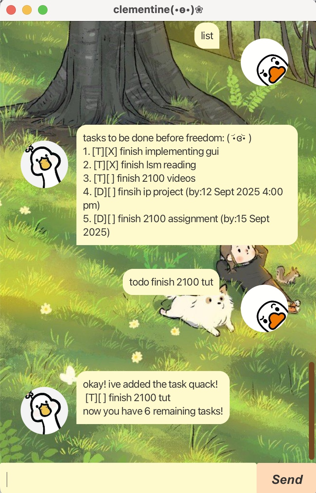

# Clementine User Guide



Meet **Clementine**, the chatbot to keep track of all your tasks, inspired by my duck jellycat •᷄ɞ•. 

## Adding deadlines

## Quick Start
1. Download and run the Clementine chatbot
2. Type your commands to start managing your tasks
3. Clementine will greet you with: `Quack! I'm clementine. What can i help you with today? ( •з• )`

## Features

### Adding Todo Tasks

Add simple tasks without any time constraints.

**Format:** `todo <description> [/priority <number>]`

**Examples:**
```declarative
todo finish cs2100 tut
todo finish lsm2107 quiz /priority 1
```

**Expected output:**
```declarative
okay! ive added the task quack!
 [T][ ] finish homework
now you have 1 remaining tasks!
```

### Adding Deadlines

Add tasks that need to be completed by a specific date and time.

**Format:** `deadline <description> /by <date> [/priority <number>]`

**Date formats supported:**
- `dd/MM/yyyy`(eg.`11/10/2025`)
- `d/M/yyyy`(eg.`3/3/2025`)
- `dd/MM/yyyy HHmm`(eg.`29/4/2025 1111`)
- `dd/MM/yyyy HH:mm`(eg.`11/11/2025 15:30`)

**Examples:**
```declarative
deadline submit ip project /by 19/9/2025
deadline submit ip project /by 19/9/2025 2359 /priority 1
```

**Expected output:**
```
okay! ive added the deadline task quack!
 [D][ ] submit ip project (by: 19 Sep 2025)
 now you have 1 remaining tasks!
```

### Adding Events

Add tasks that happen during a specific time period.

**Format:** `event <description> /from <start time> /to <end time> [/priority <number>]`

**Examples:**
```declarative
event cs2103t team meeting /from 15/9/2025 1930 /to 15/9/2025 2230
event cs2103t team meeting /from 15/9/2025 1930 /to 15/9/2025 2230 /priority 3
```

**Expected output:**
```declarative
okay! ive added the event task for u! quack!
 [E][ ] team meeting (from: 15 Sep 2025 8:30 PM to: 15 Sep 2025 10:30 PM)
now you have 1 remaining tasks!
```

### Viewing All Tasks

Display all your current tasks in a numbered list.

**Format:** `list`

**Expected output:**
```declarative
tasks to be done before freedom: ( •᷄ɞ•᷅ )
1. [T][ ] finish cs2100 tut
2. [D][X] submit ip project (by: 19 Sep 2025)
3. [E][ ] cs2103t team meeting (from: 15 Sep 2025 8:30 PM to: 15 Sep 2025 10:30 PM)
```

**Task symbols:**
- `[T]` = Todo task
- `[D]` = Deadline task
- `[E]` = Event task
- `[X]` = Completed task
- `[ ]` = Incomplete task

### Marking Task as Complete

Mark a task as done when you've completed it.

**Format:** `mark <task number>`

**Example:**
```declarative
mark 2
```

**Expected output:**
```declarative
good job! you've completed the task! quack!
 [D][X] submit assignment (by: 31 Dec 2025)
```

### Unmarking Tasks

Mark a previously completed task as incomplete.

**Format:** `unmark <task number>`

**Example:**
```declarative
unmark 2
```

**Expected output:**
```declarative
okay, ive changed this task to not done. quack!
 [D][ ] submit assignment (by: 31 Dec 2025)
```

### Deleting Tasks

Remove a task from your list permanently.

**Format:** `delete <task number>`

**Example:**
```declarative
delete 3
```

**Expected output:**
```declarative
quack! ive deleted this task for you :)
 [E][ ] team meeting (from: 19 Sep 2025 8:30 PM to: 19 Sep 2025 10:30 PM)
now you have 2 remaining tasks
```

### Finding Tasks

Search for tasks containing specific keywords.

**Format:** `find <keyword>`

**Example:**
```declarative
find homework
find ip 
```

**Expected Output:**
```declarative
quack! here's the tasks u might be looking for:
1. [T][ ] finish homework
2. [T][ ] mathematics homework
```

If no matches are found:
```declarative
oh quack! no matching tasks found!
```

### Priority Tasks

View all tasks that have been assigned a priority, sorted by priority level.

**Format:** `priority`

**Expected output:**
```declarative
quack! here's the priority list:
[1][D][X] urgent deadline (by: 25 Oct 2025)
[2][T][ ] important task
```

If no priority tasks exist:
```declarative
oh quack! no tasks with priority!
```

### Priority System

You can assign priority levels to any task type using `/priority <number>`:
- Lower numbers = Higher priority
- Tasks without priority won't appear in the priority list

### Exiting the Application

Close Clementine when you're done managing your tasks.

**Format:** `bye`

**Expected output:**
```declarative
Bye! quack u later! hope you have a great day! •᷄ɞ•
```

### Data Storage 

Clementine automatically saves your tasks to a file so you won't lose them when you close the application.
Your tasks will be restored when you restart Clementine.

### Error Messages

Clementine provides helpful error messages when something goes wrong:
- **Empty commands:** `oh quack! i can't read empty commands!`
- **Invalid task numbers:** `invalid task number!`
- **Empty descriptions:** `quack! the description of a todo cannot be empty!`
- **Invalid date formats:** `quack! invalid date/time format`
- **Task limit reached:** `oh quack! the task list is full, please complete some tasks before adding extra!`

### Command Summary 

| Command | Format | Example |
| --- | --- | --- |
| Add Todo | `todo <description> [/priority <number>]` | `todo read book /priority 1` |
| Add Deadline | `deadline <description> /by <date> [/priority <number>]` | `deadline essay /by 1/1/2025` |
| Add Event | `event <description> /from <start> /to <end> [/priority <number>]` | `event meeting /from 1/1/2025 14:00 /to 1/1/2025 16:00` |
| List Tasks | `list` | `list` |
| Mark Done | `mark <number>` | `mark 1` |
| Mark Undone | `unmark <number>` | `unmark 1` |
| Delete Task | `delete <number>` | `delete 1` |
| Find Tasks | `find <keyword>` | `find homework` |
| Priority List | `priority` | `priority` |
| Exit | `bye` | `bye` |

---

*Quack quack! Happy task managing with Clementine! ( •᷄ɞ•᷅ )*
